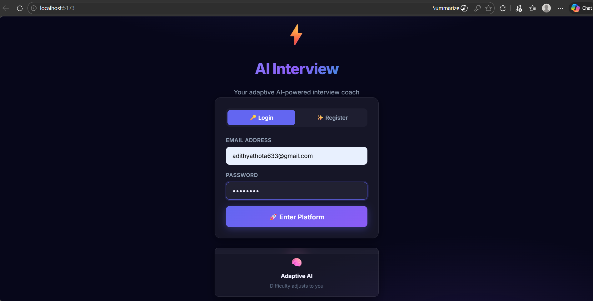
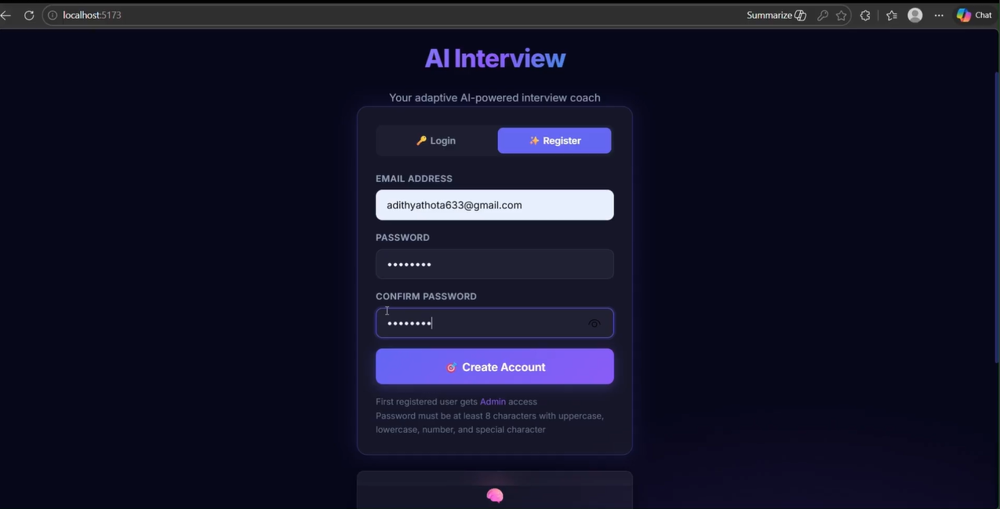
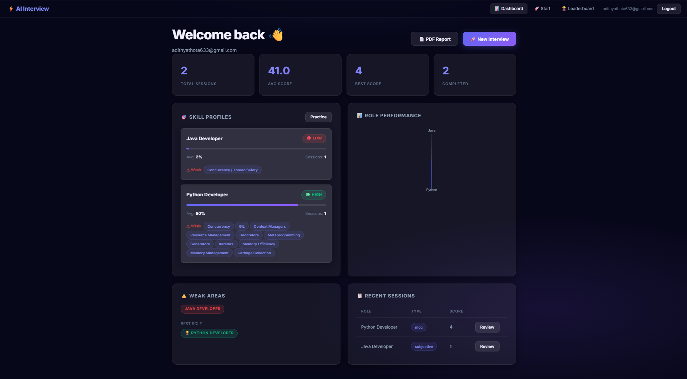
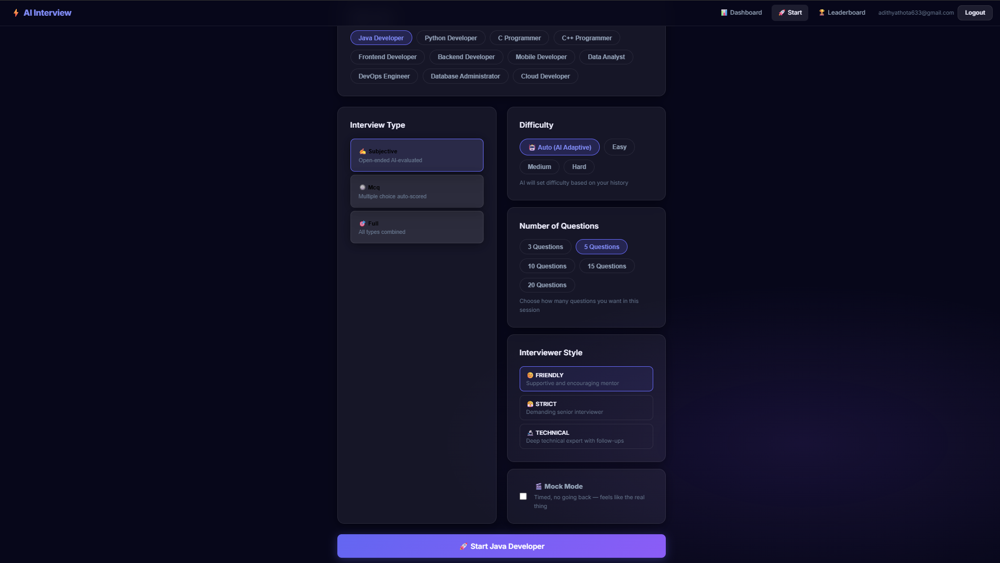
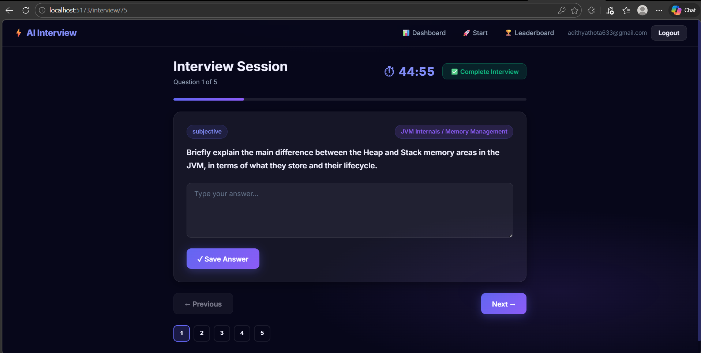
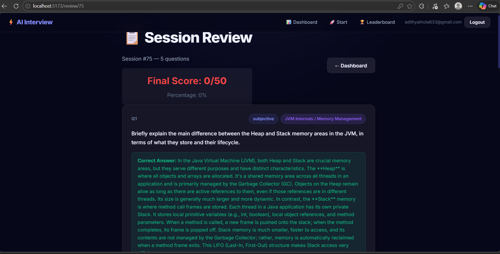
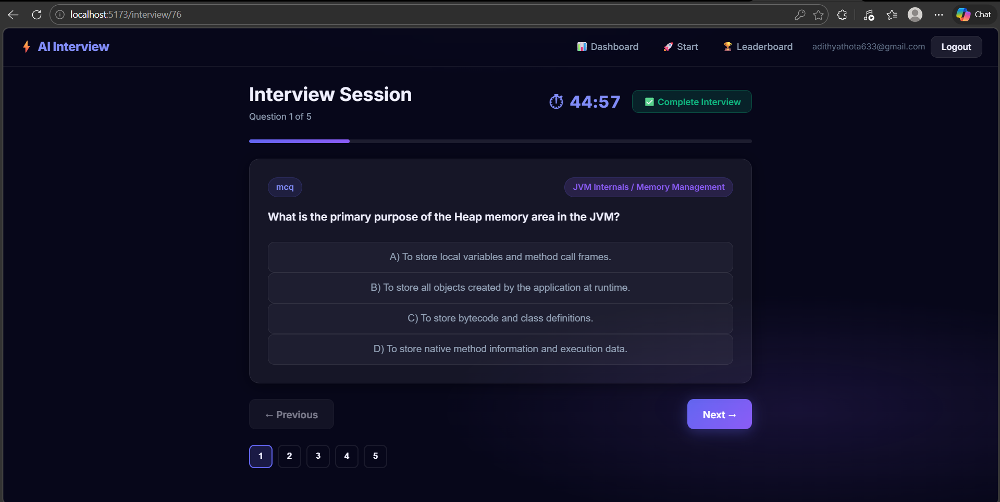
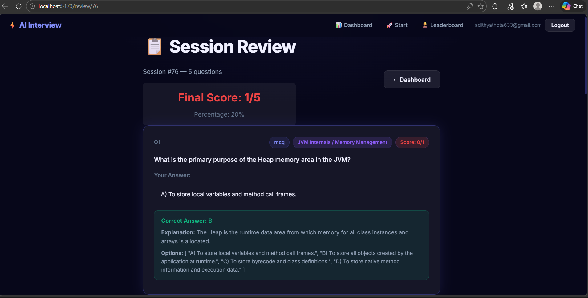
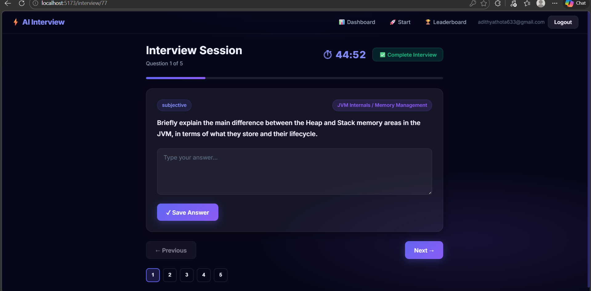

# 🎯 AI-Powered Interview Prep System

A full-stack AI-driven interview preparation platform featuring JWT authentication, real-time analytics, competitive leaderboards, and comprehensive PDF performance reports.

---

## 🚀 Tech Stack

| Layer              | Technology            | Port |
|--------------------|-----------------------|------|
| **Frontend**       | React + Vite          | 5173 |
| **Backend**        | Spring Boot + MySQL   | 8080 |
| **AI Service**     | Flask + Google Gemini | 5000 |
| **Authentication** | JWT                   |  -   |
| **Code Execution** | JDoodle API (Optional)|  -   |

---

## 🏗️ System Architecture

```
┌─────────────────────┐
│  React + Vite       │
│  (Port 5173)        │
└──────────┬──────────┘
           │
           ↓
┌─────────────────────┐
│  Spring Boot        │
│  (Port 8080)        │
└──────────┬──────────┘
           │
           ↓
┌─────────────────────┐
│  Flask AI Service   │
│  (Port 5000)        │
└──────────┬──────────┘
           │
           ↓
┌─────────────────────┐
│  Google Gemini API  │
│  + JDoodle (Optional)
└─────────────────────┘
```

---

## 📂 Project Structure

```
AI_Interview_Prep/
├── frontend/              # React + Vite Application (Port 5173)
├── interview-service/     # Spring Boot Backend (Port 8080)
└── ai-service/            # Flask AI Service (Port 5000)
```

---

## ✨ Core Features

- ✅ **JWT Authentication** - Secure register/login system
- ✅ **Role-Based Interviews** - Customized content for different roles
- ✅ **Multiple Question Types** - Subjective, MCQ, and Coding challenges
- ✅ **AI-Powered Evaluation** - Instant feedback with confidence scoring
- ✅ **Performance Analytics** - Track progress over time
- ✅ **Competitive Leaderboard** - Rank against other users
- ✅ **PDF Reports** - Exportable performance summaries
- ✅ **Rate Limiting** - Protect AI and code execution resources
- ✅ **Admin Dashboard** - Comprehensive analytics panel

---

## 🎭 Supported Professional Roles

- 💻 Java Developer
- 🐍 Python Developer
- ⚙️ C/C++ Developer
- 🔧 DevOps Engineer
- 🧪 QA Engineer
- 📊 Data Analyst
- 🌐 Web Developer

---

## 🔌 API Endpoints

### 🔹 AI Service (Flask – Port 5000)
 
| Method |       Endpoint                  |               Purpose              |
|--------|---------------------------------|------------------------------------|
| GET    | `/health`                       | Service health check               |
| POST   | `/generate-subjective`          | Generate subjective questions      |
| POST   | `/evaluate-subjective`          | AI evaluation of answers           |
| POST   | `/generate-mcq`                 | Generate multiple choice questions |
| POST   | `/evaluate-mcq`                 | MCQ auto-grading                   |
| POST   | `/generate-coding`              | Generate coding problems           |
| POST   | `/execute-code`                 | Run user code (via JDoodle)        |
| POST   | `/generate-performance-summary` | Create performance metrics         |

### 🔹 Backend (Spring Boot – Port 8080)
 
|        Endpoint       |                 Purpose                         |
|-----------------------|-------------------------------------------------|
| `/api/auth/*`         | Authentication (login, register, token refresh) |
| `/api/session/*`      | Interview session management                    |
| `/api/dashboard/*`    | User dashboard data                             |
| `/api/profile/*`      | User profile management                         |
| `/api/leaderboard`    | Global rankings                                 |
| `/api/report/{email}` | Generate PDF performance report                 |


## 🗄️ Database Configuration

- **Type**: MySQL
- **Default URL**: `jdbc:mysql://localhost:3306/interviewdb`
- **Auto Schema**: Spring Data JPA handles schema updates
  ```properties
  spring.jpa.hibernate.ddl-auto=update
  ```

---

## ⚙️ Installation & Setup

### **1️⃣ Start AI Service (Flask)**

```bash
cd ai-service
pip install -r requirements.txt
python app.py
```
- Runs on: `http://localhost:5000`

### **2️⃣ Start Backend (Spring Boot)**

```bash
cd interview-service
mvn spring-boot:run
```
- Runs on: `http://localhost:8080`

### **3️⃣ Start Frontend (React + Vite)**

```bash
cd frontend
npm install
npm run dev
```
- Runs on: `http://localhost:5173`

---

## 🔑 Environment Configuration

### **AI Service** - `.env`

```env
# Gemini API Configuration
GEMINI_API_KEY=your_key_here
MODEL_NAME=gemini-2.5-flash

# Rate Limiting
RATE_AI_GENERATE=10 per minute
RATE_CODE_EXEC=30 per minute

# JDoodle API (Optional - for code execution)
JD_CLIENT_ID=your_id_here
JD_CLIENT_SECRET=your_secret_here
```

### **Backend** - `application.properties`

```properties
# Database Configuration
spring.datasource.username=your_user
spring.datasource.password=your_pass
spring.datasource.url=jdbc:mysql://localhost:3306/interviewdb

# AI Service Integration
FLASK_URL=http://localhost:5000

# JWT Configuration
JWT_SECRET=your_secret_key_here
JWT_EXPIRY_MS=86400000  # 24 hours
```

---

## 📊 User Journey Flow

```
                                                    User Registration/Login
                                                              ↓
                                             Authentication (JWT Token Generated)
                                                              ↓
                                                   Select Professional Role
                                                              ↓
                                                   Start Interview Session
                                                              ↓
                                         Backend → Requests AI Generation (Flask)
                                                              ↓
                                                  Flask → Calls Gemini API
                                                              ↓
                                                  Display Questions to User
                                                              ↓
                                                        Submit Answers
                                                              ↓
                                                   AI Evaluation & Scoring
                                                              ↓
                                                    Store Results in MySQL
                                                              ↓
                                                 Update Dashboard & Leaderboard
                                                              ↓
                                                Generate PDF Report (Optional)
```

---

## 📸 Screenshots

### Authentication
| Login | Register |
|-------|----------|
|  |  |

### Interview Interface
| Dashboard | Start Interview | Subjective Test |
|-----------|-----------------|-----------------|
|  |  |  |

### Results & Evaluation
| Subjective Results | MCQ Interview | MCQ Evaluation |
|------------------|---------------|----------------|
|  |  |  |

### Full Mock Test
| Full Mock Test | Mock Results |
|----------------|--------------|
|  |  |

---

## 🎥 Demo Video

📹 **Watch the full system in action:**  
[View Demo on Google Drive](https://drive.google.com/file/d/1J91P9XRrq3ckWD1_ZLyrxKUr2r9D5UJy/view?usp=drive_link)

---

## 🔐 Security Features

- **JWT Token-Based Authentication** - Stateless, scalable security
- **Rate Limiting** - Prevents API abuse and resource exhaustion
- **Role-Based Access Control** - Different permissions for users/admins
- **Secure Password Storage** - Spring Security with encryption
- **CORS Configuration** - Controlled cross-origin access

---

## 📈 Performance Metrics

The system tracks:
- ✓ Accuracy scores
- ✓ Time spent per question
- ✓ Confidence levels
- ✓ Progress over multiple attempts
- ✓ Comparative rankings
- ✓ Subject-wise performance breakdown

---

## 🚀 Deployment Ready

This architecture is designed for:
- **Scalability** - Microservices separation
- **Reliability** - Rate limiting and error handling
- **Maintainability** - Clean separation of concerns
- **Cloud Compatibility** - Can be deployed on AWS, Azure, GCP

---

## 📝 License

This project is open source and available for educational purposes.

---

## 👨‍💻 Contributing

Contributions are welcome! Please feel free to submit pull requests or open issues for bugs and feature requests.

---

**Built with ❤️ for interview preparation excellence**
